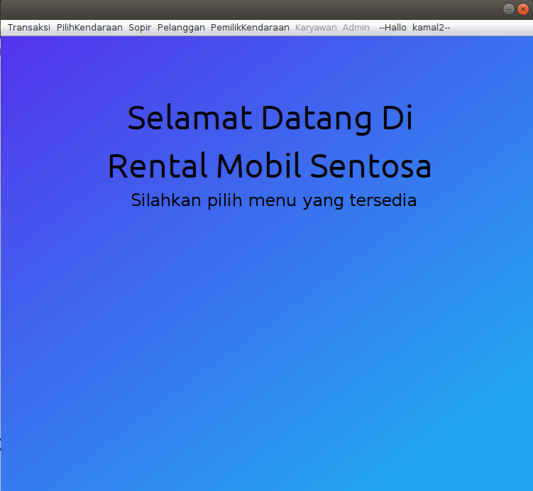
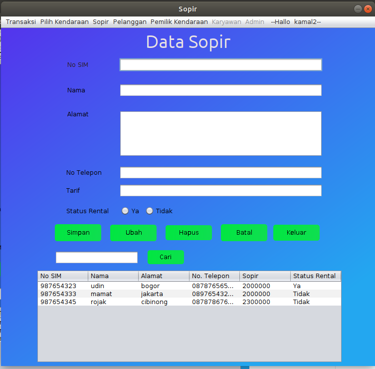
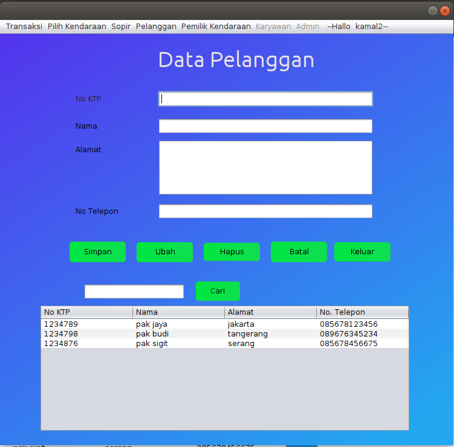
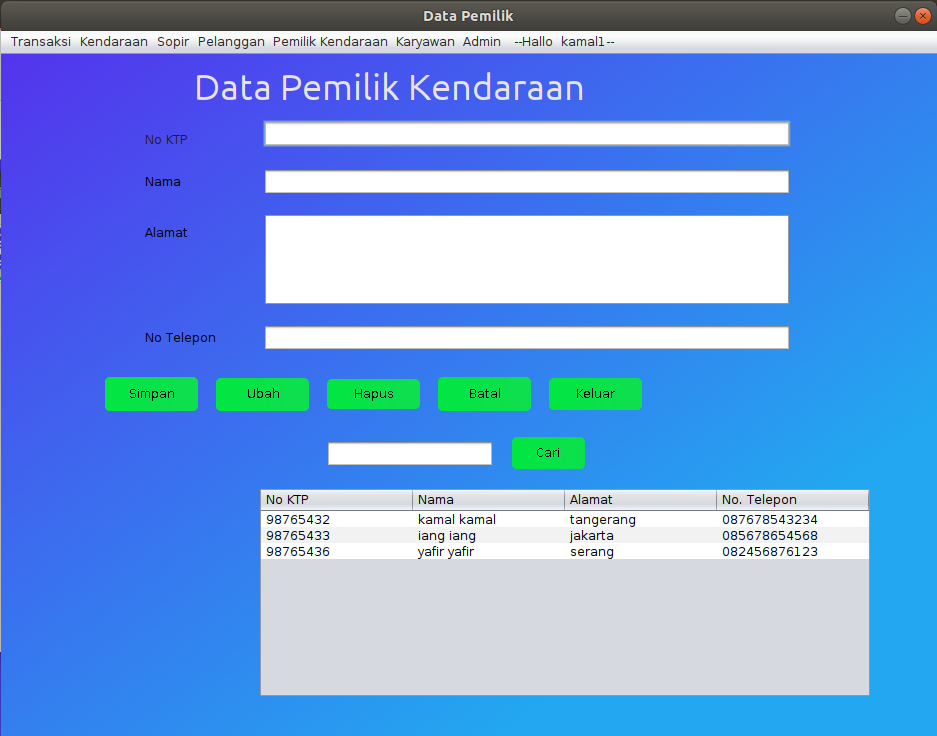
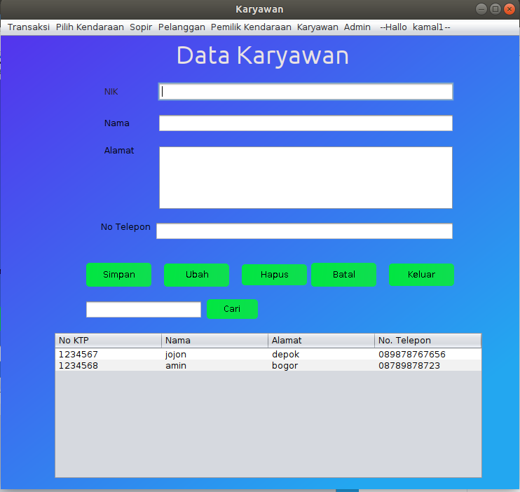

<h1>Aplikasi Rental Mobil</h1>

### Sistem Aplikasi

Aplikasi ini merupakan aplikasi untuk melakukan kegiatan rental mobil. aplikasi ini merupakan aplikasi desktop yang dibangun menggunakan java dengan database mysql. pada aplikasi ini didahului dengan login menggunakan username dan password. kemudian, dapat menginput data menginput tipe mobil yang akan disewa. aplikasi ini juga dapat mencetak hasil transaksi menjadi sebuah struk.

### Manfaat

Aplikasi ini dapat digunakan untuk yang ingin melakukan usaha rental mobil. aplikasi ini juga menyimpan semua data dari karyawan, sopir, pelanggan, dan pemilik. aplikasi ini juga menyimpan transaksi sehingga memudahkan untuk melakukan rekap data.

### Requirements

- java terbaru
- mysql

### Tata cara instalasi

instalasi hanya dilakukan di komputer linux dengan pertama mengunduh dan menginstall mysql, kemudian melakukan instalasi program menggunakan perintah 
- chmod +x nama_program
- ./nama_program
dan ikuti langkah selanjutnya.

### Manual Program

pada saat membuka, program akan meminta input username dan password. dari username tersebut akan langsung terhubung sebagai role yang sudah disiapkan sebelumnya, menjadi karyawan, sopir, pelanggan, atau pemilik. jika pelanggan akan melakukan rental mobil, dapat mengisi transaksi yang akan dilakukan dan dapat mencetak transaksi tersebut menjadi sebuah struk. berikut adalah tampilan dari program

